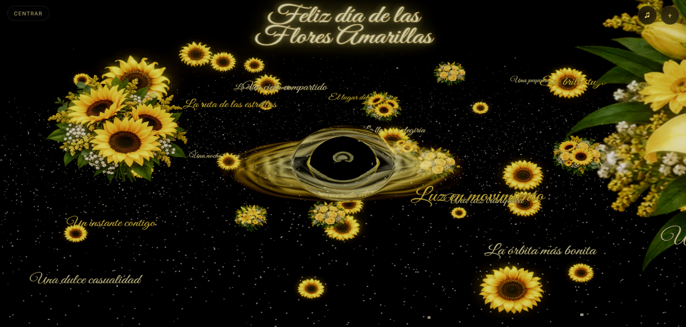

# Universo de Flores Amarillas

Experiencia WebGL cinematográfica y explorable en 360 grados construida con Three.js. La secuencia comienza con un girasol suspendido en la oscuridad, transforma sus pétalos en partículas, convierte esas partículas en estrellas y revela un universo romántico alrededor de un agujero negro amarillo-blanco.

Toda la narrativa ocurre dentro de una única escena 3D y un único ciclo de renderizado. No son páginas independientes ni una simulación de interfaz móvil.

## Vista del despliegue

La imagen muestra la etapa explorable: el agujero negro ocupa el centro del universo, las microestrellas generan profundidad y las flores, ramos y frases se distribuyen en distintas órbitas. El usuario puede rodear esta composición, elevar la cámara, acercarse y seleccionar cualquier elemento para abrir su carta.

Versión pública: <https://jhakami.github.io/flores-amarillas-universo/>

## Secuencia de la experiencia

~~~text
oscuridad
  → nacimiento del girasol
  → toque del usuario
  → girasol convertido en partículas
  → título formado por partículas
  → viaje entre estrellas
  → aparición del agujero negro
  → flores, ramos y frases espaciales
  → exploración orbital 360 grados
  → enfoque de un objeto
  → carta romántica
~~~

En la etapa final se puede rotar alrededor del universo, elevar la cámara, acercarse o alejarse y tocar flores, ramos o frases. Cada elemento está asociado a una carta propia.

## Tecnologías

| Tecnología | Responsabilidad |
|---|---|
| HTML5 y CSS3 | Canvas, overlays accesibles, editor y responsive |
| JavaScript ES Modules | Arquitectura modular, estado y ciclo de vida |
| Vite | Desarrollo, carga de GLSL, build y bundles |
| Three.js | Escena 3D, cámara, partículas, instancing y raycasting |
| GLSL | Morph, estrellas, disco, photon ring y lensing |
| GSAP | Timelines narrativos y transiciones de cámara |
| Troika Three Text | Título y frases SDF dentro del espacio 3D |
| Tweakpane | Editor visual oculto |
| Web Audio API | Ambiente sonoro activado por gesto |
| Vitest y ESLint | Pruebas y calidad estática |
| GitHub Actions | Validación y despliegue en Pages |

No se utiliza React, Laravel, Python ni backend. La experiencia se ejecuta completamente en el navegador.

## Requisitos

- Node.js 20 o posterior.
- npm 10 o posterior.
- Navegador moderno con WebGL.
- WebGL 2 recomendado para calidad HIGH.

## Instalación local

~~~bash
git clone https://github.com/Jhakami/flores-amarillas-universo.git
cd flores-amarillas-universo
npm install
npm run dev
~~~

Vite mostrará una dirección local, normalmente:

~~~text
http://localhost:5173/flores-amarillas-universo/
~~~

### Abrir desde un teléfono en la misma red

~~~bash
npm run dev -- --host 0.0.0.0
~~~

Busca la dirección IPv4 del computador con ipconfig en Windows y abre desde el móvil:

~~~text
http://IP_DEL_COMPUTADOR:5173/flores-amarillas-universo/
~~~

El teléfono y el computador deben estar en la misma red. Windows puede pedir permiso para que Node.js atraviese el firewall privado.

### Ejecutar con Termux

~~~bash
pkg update
pkg install nodejs-lts git
git clone https://github.com/Jhakami/flores-amarillas-universo.git
cd flores-amarillas-universo
npm install
npm run dev -- --host 0.0.0.0
~~~

## Scripts

| Comando | Función |
|---|---|
| npm run dev | Servidor con recarga automática |
| npm run lint | Revisión del código y las pruebas |
| npm test | Pruebas unitarias |
| npm run build | Build optimizado en dist |
| npm run preview | Vista local del build |

Antes de publicar:

~~~bash
npm run lint
npm test
npm run build
~~~

## Controles

### Ratón y pantalla táctil

- Tocar o hacer clic en el girasol: comenzar.
- Arrastrar: orbitar alrededor del universo.
- Pellizcar o usar la rueda: acercar y alejar.
- Tocar una flor, ramo o frase: enfocar y abrir su carta.
- Tocar fuera o deslizar la carta hacia abajo: cerrar.
- Botón Centrar: regresar a la composición principal.

### Teclado

- E: abrir o cerrar el editor.
- Esc: cerrar la carta o el editor.
- M: activar o silenciar el audio.
- R: reiniciar la experiencia.

El audio nunca se reproduce automáticamente.

## Arquitectura por capas

La aplicación utiliza una escena Three.js única. App crea los servicios, objetos y controladores, y coordina todo mediante un solo requestAnimationFrame.

~~~text
Entrada
  main.js
    ↓
Orquestación
  App + SceneManager
    ↓
Experiencia
  ParticleMorph + CameraRig
    ↓
Mundo 3D
  Sunflower + GalaxyField + BlackHole
  FlowerInstanceSystem + SpatialTextSystem
    ↓
Interacción
  InputManager + UniverseRaycaster + InteractiveRegistry
    ↓
Render
  Renderer → Lens → Bloom → Vignette → Output
    ↓
Interfaz accesible
  prompts + controles + cartas + editor
~~~

### Capa 1: entrada

src/main.js obtiene el canvas, crea App, inicia la carga y activa un fallback accesible si WebGL no está disponible.

### Capa 2: orquestación

src/core/App.js es el composition root. SceneManager conserva el estado:

~~~text
BOOT → INTRO → MORPH → MESSAGE → TRAVEL
     → BLACK_HOLE_REVEAL → UNIVERSE ⇄ QUOTE_FOCUS
~~~

Los estados no son páginas. Determinan qué sistemas se actualizan y qué progresos o uniforms cambian.

### Capa 3: partículas

SunflowerParticleCloud contiene posiciones iniciales, intermedias y finales. ParticleMorph anima uniforms sin recalcular posiciones en cada frame. La misma geometría termina formando parte del campo estelar.

TextParticleCloud forma el mensaje en dos líneas equilibradas. MessageOverlay ya no dibuja otra copia: solamente anuncia el título mediante aria-live. Esto corrige la frase incompleta y duplicada que aparecía sobre la composición.

### Capa 4: universo

GalaxyField coordina polvo y destellos. BlackHole agrupa horizonte, disco y photon ring. FlowerInstanceSystem representa muchas flores con pocos draw calls. SpatialTextSystem utiliza Troika para mantener frases legibles dentro del espacio.

### Capa 5: cámara e interacción

CameraRig alterna entre introducción, viaje, órbita, foco y retorno. InteractiveRegistry relaciona meshes e instancias con IDs del catálogo. UniverseRaycaster limita el raycast a esos elementos.

### Capa 6: render

~~~text
THREE.Scene
  → RenderPass
  → GravitationalLensPass
  → UnrealBloomPass
  → compresión de altas luces
  → vignette
  → OutputPass
~~~

La exposición, el bloom y la luminancia de partículas usan límites seguros para conservar el fondo negro.

La arquitectura completa está explicada en [docs/ARCHITECTURE_V2.md](docs/ARCHITECTURE_V2.md).

## Estructura

~~~text
src/
├─ core/            servicios, loop, cámara y estado
├─ experience/      transición de partículas
├─ objects/         objetos y sistemas Three.js
├─ shaders/         programas GLSL
├─ postprocessing/  lensing, bloom y acabado
├─ interactions/    teclado, touch y raycasting
├─ ui/              overlays accesibles y editor
├─ config/          defaults, validación y migraciones
├─ data/            catálogo de cartas y frases
├─ styles/          estilos y responsive
└─ utils/           layout determinista
~~~

## Configuración y editor

El editor Tweakpane se abre con E. Permite ajustar exposición, cámara, galaxia, agujero negro, bloom, flores y contenido.

La configuración:

- Se valida antes de utilizarse.
- Se guarda bajo yellowUniverseConfig.
- Migra automáticamente versiones anteriores.
- Limita exposición y bloom a rangos seguros.
- Puede importarse, exportarse y restaurarse.

Los valores oficiales están en src/config/defaultConfig.js, los límites en configSchema.js y las migraciones en migrations.js.

## Rendimiento

| Perfil | DPR | Estrellas | Polvo | Destellos | Flores | Textos |
|---|---:|---:|---:|---:|---:|---:|
| LOW | 1.25 | 2,000 | 700 | 80 | 20 | 14 |
| MEDIUM | 1.6 | 6,000 | 2,000 | 180 | 42 | 20 |
| HIGH | 2.0 | 14,000 | 5,000 | 320 | 72 | 24 |

PerformanceManager selecciona el perfil y puede degradarlo si el rendimiento permanece bajo el mínimo. La narrativa y el catálogo no se pierden.

## Accesibilidad

- Soporte para prefers-reduced-motion.
- Uso completo sin hover.
- Foco visible y carta modal.
- Anuncios mediante aria-live.
- Controles con nombres accesibles.
- Fallback textual sin WebGL.
- Audio siempre iniciado por el usuario.

## Assets

~~~text
public/assets/flowers/sunflower-hero-v2.webp
public/assets/flowers/sunflower-atlas-v2.webp
public/assets/flowers/bouquet-atlas-v2.webp
public/assets/fonts/great-vibes.ttf
docs/assets/universo-desplegado.png
~~~

## Despliegue

Vite utiliza base /flores-amarillas-universo/. Cada push a main ejecuta:

~~~text
npm ci
  → lint
  → tests
  → build
  → upload dist
  → GitHub Pages
~~~

En GitHub, Pages debe utilizar GitHub Actions como fuente.

## Diagnóstico

### El título aparece duplicado o incompleto

La representación visible debe provenir únicamente de TextParticleCloud. MessageOverlay es un anunciador oculto. Comprueba que no se haya restaurado la antigua clase visual message.

### La pantalla aparece demasiado blanca

Revisa general.exposure, bloom.strength, bloom.threshold y blackHole.photonIntensity. La configuración V3 aplica límites seguros.

### La página muestra una versión anterior

Cierra la pestaña y vuelve a abrirla o limpia la caché del sitio.

### No abre desde otro dispositivo

Inicia Vite con --host 0.0.0.0, usa la IPv4 del computador y permite Node.js en el firewall privado.

## Documentación

- [Arquitectura detallada](docs/ARCHITECTURE_V2.md)
- [Decisiones técnicas](docs/DECISIONS_V2.md)
- [Especificación visual](docs/VISUAL_SPEC_V2.md)
- [Rendimiento](docs/PERFORMANCE.md)
- [QA](docs/QA.md)
- [Reglas para agentes](AGENTS.md)
- [Contrato maestro](MASTER_PROMPT_V2.md)

## Colaboración

Antes de modificar módulos compartidos, consulta AGENTS.md. Todo cambio en contratos, configuración pública o ciclo narrativo debe acompañarse de lint, pruebas y build.
